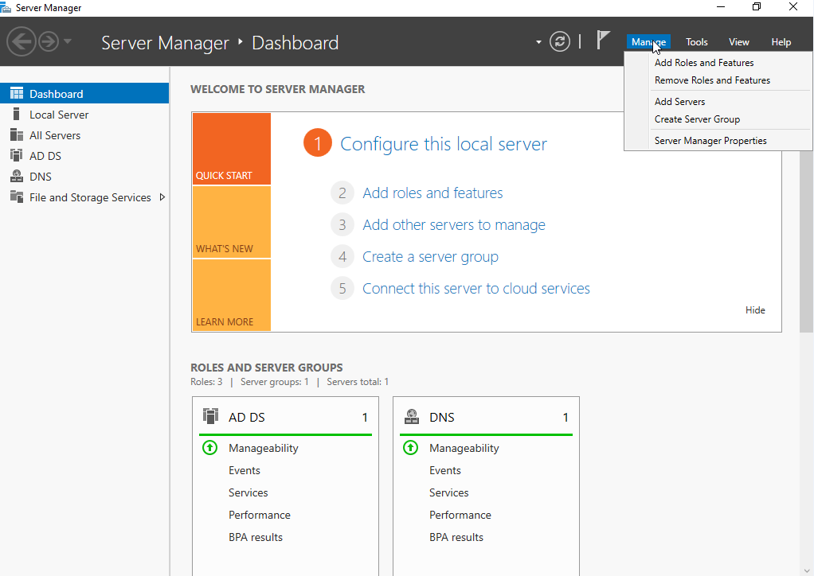
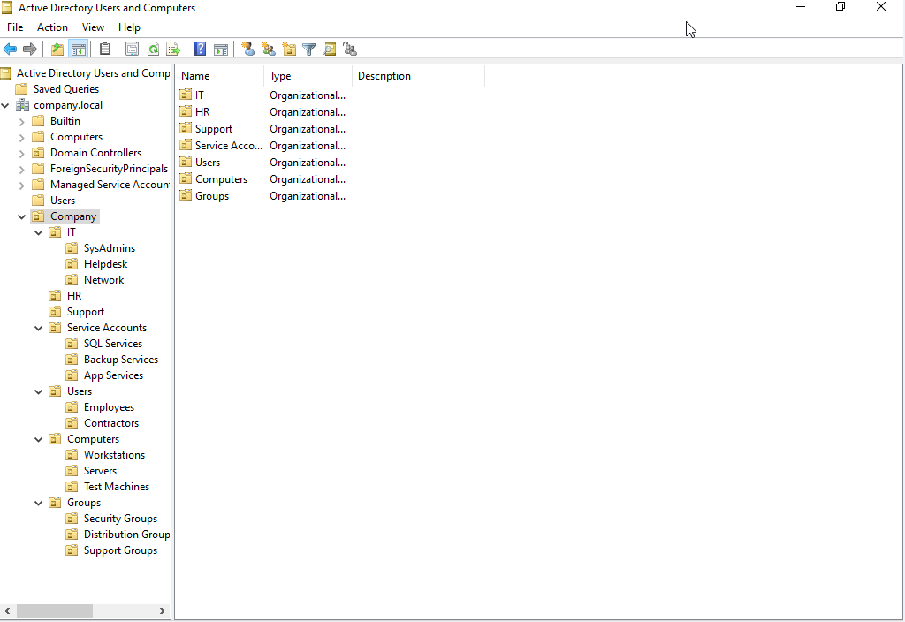
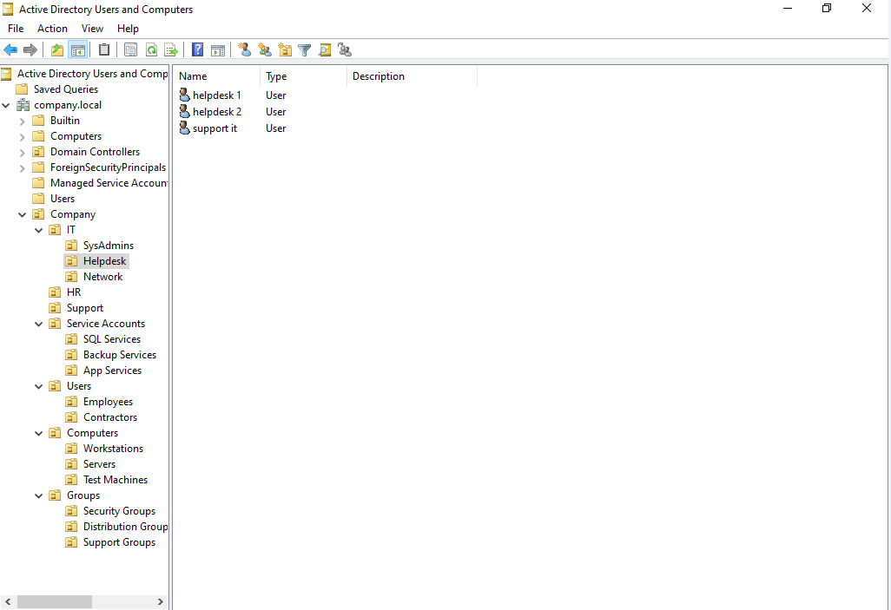
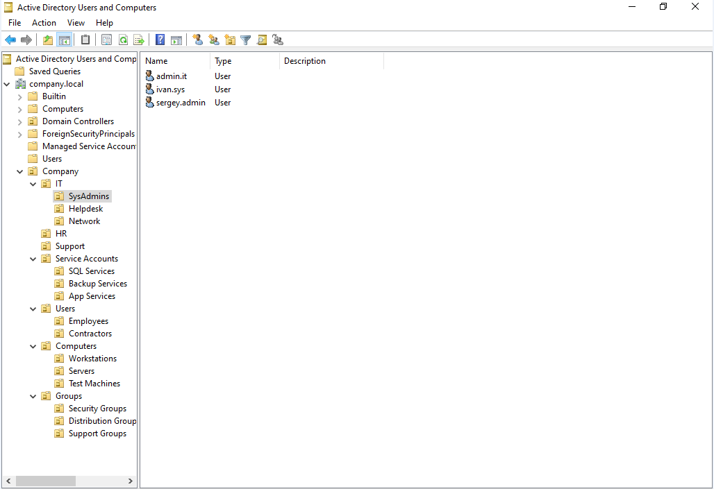
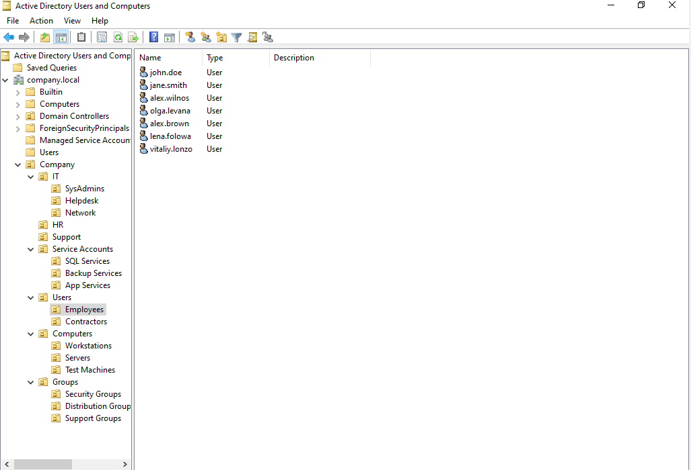
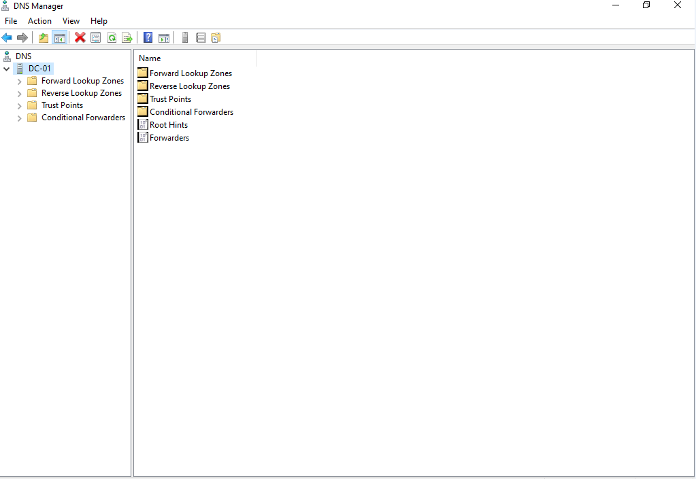
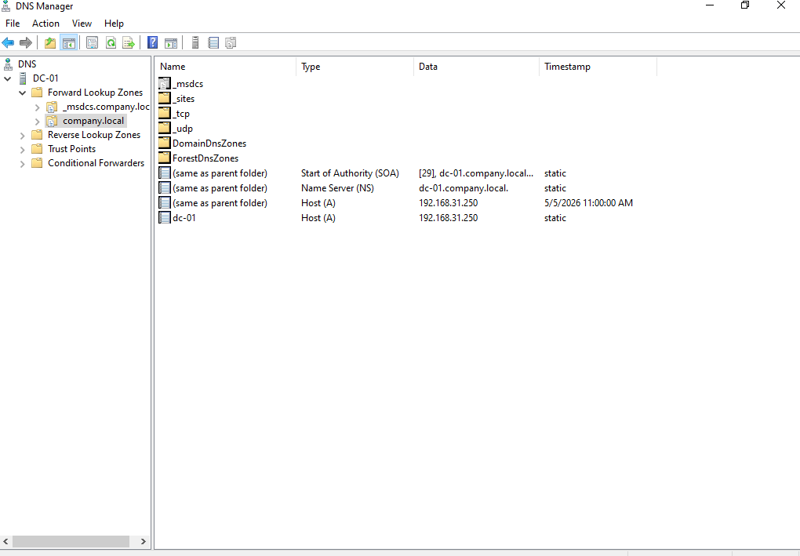
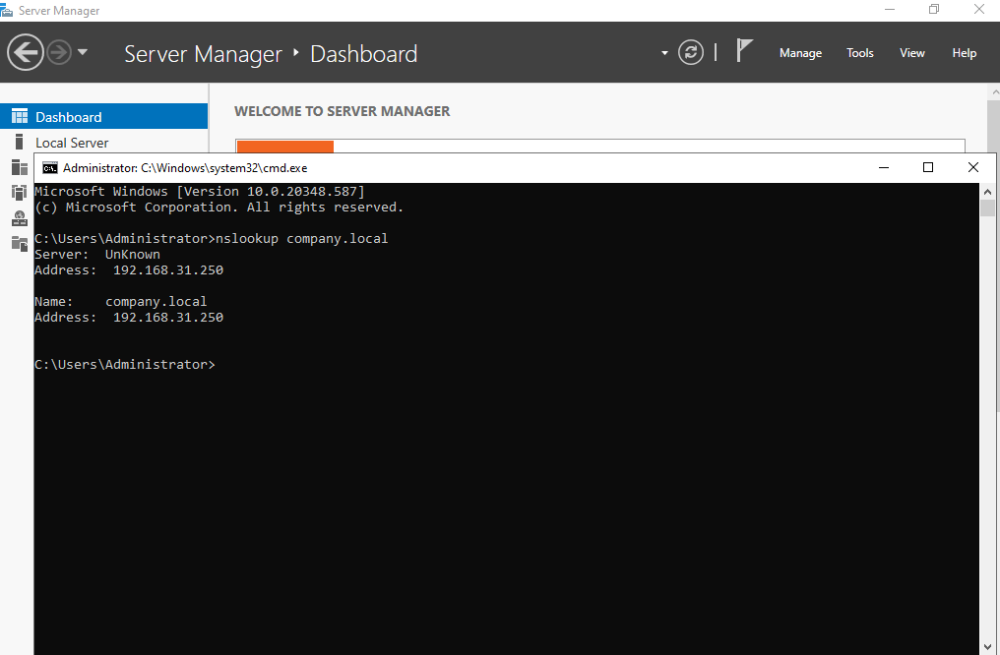
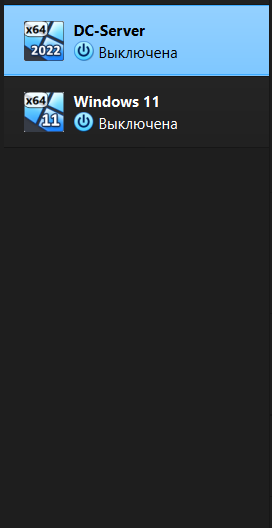
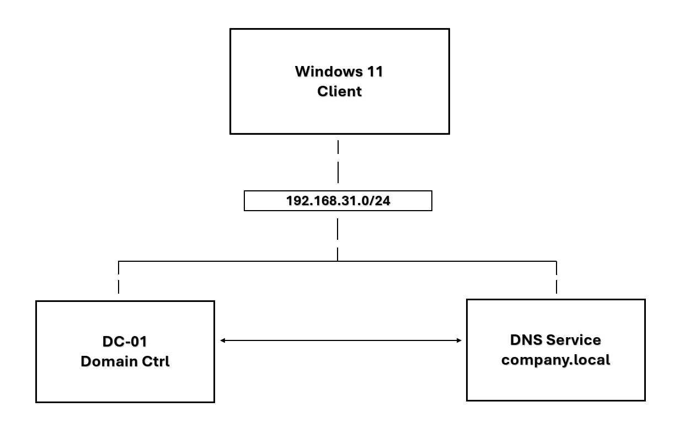

# Active Directory Home Lab

## Обзор
Этот проект демонстрирует развертывание и настройку базовой среды Active Directory с использованием Windows Server.

Целью проекта было моделирование инфраструктуры небольшой компании с доменными службами, DNS и организацией пользователей.

## Обзор архитектуры
Клиент → DNS → Контроллер домена → Active Directory

---

## Окружение
- Windows Server (контроллер домена)
- VirtualBox / VMware
- Windows 11 (клиент — опционально)

---

## Информация о домене
- Имя домена: **company.local**
- Контроллер домена: **DC-01**

---

## Настроенные компоненты

### Active Directory
- Установлены службы Active Directory Domain Services (AD DS)
- Сервер повышен до роли контроллера домена

### DNS
- Настроен DNS-сервер на контроллере домена
- Создана зона прямого просмотра: `company.local`
- Проверено разрешение доменных имен

### Организационная структура
- Созданы Organizational Units (OU):
  - IT
  - HR
  - Users
- Созданы учетные записи пользователей домена

---

## Проверка работоспособности

Тест разрешения DNS:

- nslookup company.local

Ожидаемый результат:
- Возвращается IP-адрес контроллера домена

---

## Group Policy (GPO)

В домене были применены базовые настройки групповых политик:

- Настройка политики паролей
- Политика блокировки учетных записей
- Изменения стандартной доменной политики

Эти политики обеспечивают базовое усиление безопасности среды.

---

## Схема IP-адресации

| Device        | IP Address       | Role                |
|--------------|-----------------|--------------------|
| DC-01        | 192.168.31.250  | Domain Controller   |
| Windows 11   | 192.168.31.10   | Client Machine      |
| Gateway      | 192.168.31.1    | Network Gateway     |

Маска подсети: 255.255.255.0  
DNS-сервер: 192.168.31.250

---

## Скриншоты

### Структура Active Directory

### Пользователи в Organizational Units

### Пользователи в IT (Helpdesk)

### Пользователи в IT (Администраторы)

### Пользователи в Employees

### Настройка DNS

### company.local

### Тест разрешения домена

### Сервер-клиент

##  Схема сети
Диаграмма ниже показывает архитектуру лабораторной сети.

---

## Примечания
Подключение клиентской машины к домену не было завершено из-за ограничений редакции Windows Home.

---

## Результат
Была успешно развернута рабочая среда Active Directory с DNS и организационной структурой, имитирующей инфраструктуру реальной компании.
